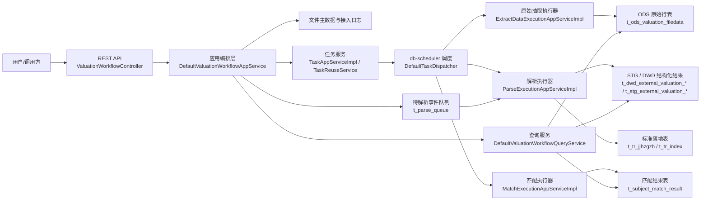
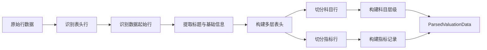

# valset-standardizer 架构与技术总览

本文档用于说明当前 `valset-standardizer` 项目的核心业务流程、模块边界、数据分层、任务模型和关键解析规则，作为后续扩展设计、排障和文档拆分的基准。

## 1. 项目定位

`valset-standardizer` 是一个面向外部估值表的离线批处理标准化引擎，目标不是提供一个单纯的 Excel 解析器，而是完成一条可追溯、可回放、可复用的数据处理流水线：

1. 接收外部估值文件
2. 抽取原始行数据到 ODS
3. 基于原始行数据进行结构化解析
4. 对表头、科目和指标做标准化
5. 将外部科目与内部标准科目进行匹配
6. 按 `fileId` 回查各阶段结果

这个工程更适合被理解为“模块化单体 + 轻量任务编排 + 分层数据落地”的组合，而不是微服务化架构。

## 2. 模块边界

### 2.1 根工程

- `valset-standardizer-parent`
- 负责统一 Maven 版本、依赖管理和模块聚合

### 2.2 `core`

- 负责领域模型、用例接口、解析抽象、匹配抽象
- 不直接依赖 Excel / CSV 解析实现
- 不承载数据库持久化细节

### 2.3 `infra`

- 负责 PO、Repository、Convertor、GatewayImpl
- 负责 MyBatis 和数据库访问
- 负责把领域对象和表结构互相转换

### 2.4 `tools`

`tools` 是一个聚合模块，下面再拆成：

- `knowledge`
- `extract`
- `analysis`
- `batch`

职责分别是：

- `knowledge`：标准科目、历史映射、评估样本等知识加载
- `extract`：原始数据抽取、标准化辅助、匹配引擎
- `analysis`：待解析事件订阅、队列状态管理、结构化解析执行
- `batch`：任务调度、任务路由、执行器分派

### 2.5 `boot`

- 负责 REST 接口
- 负责任务创建与流程编排
- 负责启动入口和运行时配置

## 3. 总体架构

## 4. 核心业务流程

### 4.1 文件接入

1. 用户上传文件。
2. `UploadedFileStorageService` 负责落盘。
3. `ValsetFileInfo` 作为文件主数据被创建或更新。
4. `ValsetFileIngestLog` 记录每次接入事件。
5. 文件指纹用于幂等去重。

### 4.2 原始抽取

1. 为文件创建 `EXTRACT_DATA` 任务。
2. 调度器触发任务分发。
3. `DefaultTaskDispatcher` 找到 `ExtractDataTaskExecutor`。
4. `ExtractDataExecutionAppServiceImpl` 按行写入 `t_ods_valuation_filedata`。
5. 同时保存 sheet 样式等原始辅助信息。

### 4.3 待解析事件订阅

1. `DefaultDeliverService` 在投递成功后发布待解析事件。
2. `DefaultParseQueueManagementAppService` 生成或更新 `t_parse_queue`。
3. `t_parse_queue` 记录订阅者、订阅时间、解析状态和快照信息。
4. 订阅者接管 `PENDING` 事件后将状态推进到 `PARSING`。

### 4.4 结构化解析

1. `ParseExecutionAppServiceImpl` 从任务表读取入参 `ParseTaskCommand`。
2. 通过 `ValuationDataParserProvider` 路由到对应解析器。
3. 当前主线是 `OdsValuationDataParser` 和 `CsvValuationDataParser`。
4. 解析得到标题、基础信息、多层表头、科目行、指标行。
5. 解析结果落入 STG / DWD / 标准落地表。

### 4.5 标准化

1. `ExternalValuationStandardizationService` 对表头做映射。
2. 标准化后的科目和指标补齐标准编码、映射来源、映射置信度。
3. 标准化结果可根据配置写入额外明细表。

### 4.6 匹配

1. `MatchExecutionAppServiceImpl` 优先使用已落地的标准化结果。
2. 加载标准科目和历史映射提示。
3. `SimpleValsetMatcher` 执行锚点选择、候选召回、规则打分和置信度分类。
4. `MatchResultGatewayImpl` 持久化匹配结果。

### 4.7 查询

按 `fileId` 查询：

- ODS 原始数据
- STG 解析快照
- DWD 标准数据
- 匹配结果

## 5. 任务模型

### 5.1 任务类型

`TaskType` 当前包含：

- `EXTRACT_DATA`
- `PARSE_WORKBOOK`
- `MATCH_SUBJECT`
- `EVALUATE_MAPPING`
- `EXPORT_RESULT`
- `REFRESH_STANDARD_SUBJECT`
- `REFRESH_MAPPING_HINT`

### 5.2 任务状态

`TaskStatus` 当前包含：

- `PENDING`
- `SCHEDULED`
- `RUNNING`
- `SUCCESS`
- `FAILED`
- `RETRYING`
- `CANCELED`

### 5.3 任务阶段

`TaskStage` 当前包含：

- `EXTRACT`
- `PARSE`
- `STANDARDIZE`
- `MATCH`
- `OTHER`

### 5.4 任务编排方式

- `TaskAppServiceImpl` 创建任务并立即触发
- `TaskReuseService` 根据 `businessKey` 和 `forceRebuild` 决定是否复用成功任务
- 调度服务只负责触发，不承载业务逻辑
- `DefaultTaskDispatcher` 按 `TaskType` 路由到执行器

## 6. 数据分层

### 6.1 文件层

- `t_subject_match_file_info`
- `t_subject_match_file_ingest_log`

用于管理文件身份、来源、存储位置和生命周期。

### 6.2 任务层

- `t_subject_match_task`
- `t_subject_match_schedule`

用于管理任务执行、阶段耗时和计划调度。

### 6.3 待解析事件层

- `t_parse_queue`

用于管理投递成功后的待解析事件、订阅状态、解析结果快照和失败重试信息。

### 6.4 ODS 层

- `t_ods_valuation_filedata`
- `t_ods_valuation_sheet_style`

用于保留原始行数据和 sheet 样式，作为可追溯入口。

### 6.5 STG 层

- `t_stg_external_valuation`
- `t_stg_external_valuation_basic_info`
- `t_stg_external_valuation_header`
- `t_stg_external_valuation_subject`
- `t_stg_external_valuation_metric`

用于保存解析后的结构化视图。

### 6.6 DWD 层

- `t_dwd_external_valuation`
- `t_dwd_external_valuation_basic_info`
- `t_dwd_external_valuation_header`
- `t_dwd_external_valuation_subject`
- `t_dwd_external_valuation_metric`

用于保存标准化后的结构化事实。

### 6.7 知识层

- `t_ods_standard_subject`
- `t_ods_mapping_hint`
- `t_ods_mapping_sample`

用于提供标准科目、历史映射和评估样本。

### 6.8 结果层

- `t_subject_match_result`
- `t_tr_jjhzgzb`
- `t_tr_index`

用于保存匹配结果和标准落地表。

## 7. 解析规则

### 7.1 标题规则

| 项 | 规则 |
|---|---|
| 标题识别 | 表头前仅有一个有效文本且不含 `:` / `：` 的行优先作为标题候选 |
| 标题选择 | 多个候选时，取最长的文本 |

### 7.2 基础信息规则

| 项 | 规则 |
|---|---|
| 键值格式 | 在表头前扫描 `键:值` / `键：值` |
| 缺值补偿 | 如果冒号后为空，继续向右找下一格有效值 |
| 输出 | 存为 `basicInfo` 键值对集合 |

### 7.3 表头规则

| 项 | 规则 |
|---|---|
| 表头起点 | 找到同时包含 `科目代码` 和 `科目名称` 的行 |
| 多层表头 | 表头行到数据起始行之间的非空行都纳入表头层级 |
| 空白补齐 | 同一行内空白单元格会继承左侧最近非空值 |
| 表头输出 | 生成 `headers`、`headerDetails`、`headerColumns` |

### 7.4 科目行规则

| 项 | 规则 |
|---|---|
| 行识别 | 前 5 个单元格中找到像科目代码的值，并且后面 4 个单元格中能找到科目名称 |
| 代码归一 | 去掉空格、全角点、标点等，保留适合比较的紧凑形式 |
| 层级构造 | 按代码片段生成 `pathCodes`，再反推 `parentCode` 和 `leaf` |
| 输出 | `SubjectRecord` |

### 7.5 指标行规则

| 项 | 规则 |
|---|---|
| 单值指标 | 第一有效单元格后只有 1 个有效值，且该值像数字 |
| 宽表指标 | 第一有效单元格后至少 2 个有效值，且至少有一个像数字 |
| 指标名称 | 取第一有效单元格文本，去掉尾部冒号 |
| 输出 | `MetricRecord` |

### 7.6 解析流程

## 8. 匹配规则

### 8.1 匹配引擎策略

`SimpleValsetMatcher` 当前采用的策略顺序是：

1. 选择 anchor 节点
2. 召回标准科目候选
3. 按名称、路径、关键词、编码、历史和 embedding 进行打分
4. 取 Top K 候选
5. 进行层级 override
6. 按置信度分类并决定是否需要复核

### 8.2 评分特点

| 维度 | 说明 |
|---|---|
| `scoreName` | 名称相似度 |
| `scorePath` | 路径相似度 |
| `scoreKeyword` | 关键词相似度 |
| `scoreCode` | 编码相似度 |
| `scoreHistory` | 历史映射权重 |
| `scoreEmbedding` | 向量兜底权重 |

### 8.3 结果输出

`ValsetMatchResult` 保存：

- 外部科目编码和名称
- anchor 科目和路径
- 最终标准科目编码和名称
- 分项得分
- 置信度
- 是否需要复核
- 候选集

## 9. 运行配置

当前运行配置的关键点：

- 应用端口：`30066`
- Quartz：内存 JobStore
- 上传目录：`uploads`
- 输出目录：`output`
- MyBatis mapper 扫描：`com.yss.valset.extract.repository.mapper`
- Tracing：已接入 OTLP

这些配置说明当前运行目标是本地可启动、可调试、可验证。

## 10. 设计约束

1. Excel / CSV 解析逻辑不要回流到分析模块。
2. 分析模块不要直接打开外部文件。
3. 文件主数据必须独立于任务存在。
4. 任务表只承载执行上下文，不承载文件身份。
5. 标准化和匹配要分层，避免把所有规则塞进一个类。
6. 规则扩展优先走配置、映射表和知识表，不优先硬编码。

## 11. 当前演进结论

- 主链路已经闭合。
- 解析、标准化、匹配、评估都已具备工程入口。
- 现在更适合继续做规则沉淀、文件治理、任务治理和回放能力。
- 从架构上看，继续保持“模块化单体 + 批处理编排”的方向是合理的。
