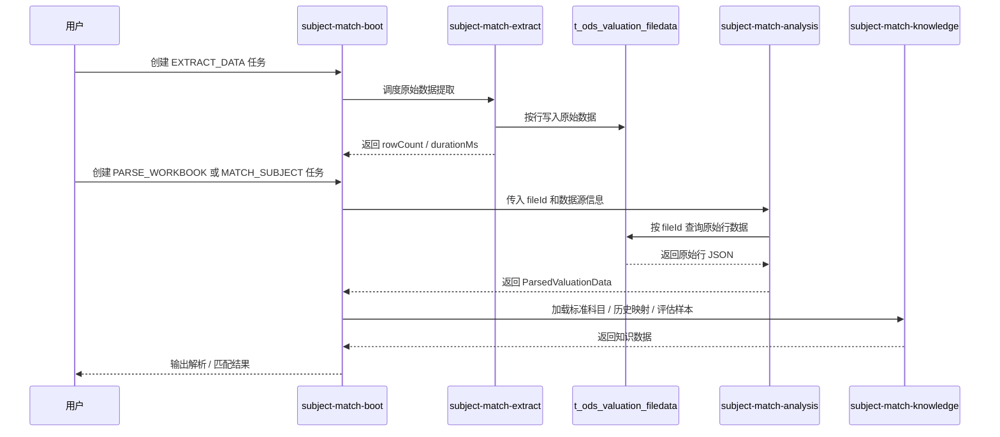

# ODS 原始数据分析链路设计

本文档说明估值表处理链路从“直接解析 Excel/CSV”调整为“先抽取原始行数据，再基于 ODS 行表分析”的新架构。

## 目标

- 将原始文件摄取与业务分析彻底解耦。
- 分析阶段不再直接依赖 Excel / CSV 文件格式。
- 统一以 `t_ods_valuation_filedata` 作为原始数据入口。
- 保留 API / DB 等其他数据源的兼容能力。

## 模块职责

### `subject-match-extract`

- 负责 Excel / CSV 原始数据抽取。
- 负责将每一行原始数据落到 `t_ods_valuation_filedata`。
- 提供 `ValuationFileDataMapper` 和原始数据查询能力。

### `subject-match-analysis`

- 负责基于 ODS 原始行数据进行估值分析。
- 通过 `fileId` 查询 `t_ods_valuation_filedata`。
- 还原表头、标题、基础信息、科目明细和指标行。
- 对外输出 `ParsedValuationData`。
- 对外只暴露分析门面接口，具体路由实现由内部 facade 处理。

### `subject-match-knowledge`

- 负责标准科目、历史映射提示和评估样本加载。
- 对外提供标准科目加载门面，供匹配与评估流程复用。

### `subject-match-tools`

- 作为非 DDD 通用工具库的聚合模块，统一承载 `knowledge`、`extract`、`analysis` 和 `batch` 四个子模块。

### `subject-match-boot`

- 负责任务创建、任务调度和 API 编排。
- 在解析 / 匹配任务中传递 `fileId`。
- 将分析结果和任务状态写回任务表。

### `subject-match-core`

- 负责领域模型、分析抽象、匹配抽象和结果对象。
- 不直接依赖 Excel / CSV 文件读取实现。

## 核心链路

## 时序图

## 数据流说明

1. 提取阶段只关心“文件 -> 原始行数据”。
2. 分析阶段只关心“原始行数据 -> 结构化估值结果”。
3. 匹配阶段消费 `ParsedValuationData`，并通过 `subject-match-knowledge` 加载标准科目和映射提示。
4. `fileId` 是连接提取与分析的关键上下文。

## 设计约束

- Excel / CSV 解析逻辑不得再进入分析模块。
- 分析模块不得直接打开外部文件。
- 知识加载能力不得再留在 `subject-match-infra`，必须由独立模块提供。
- 原始数据表必须保留任务关联和文件关联信息。
- 任务执行日志需要覆盖开始、选择分析器、完成、异常这几个关键节点。

## 现状

- 原始提取链路已迁移至 `subject-match-tools/extract`。
- 原始数据分析链路已迁移至 `subject-match-tools/analysis`。
- 标准科目与映射知识加载链路已迁移至 `subject-match-tools/knowledge`。
- 批处理调度链路已迁移至 `subject-match-tools/batch`。
- `subject-match-boot` 仅保留任务编排和接口层。
