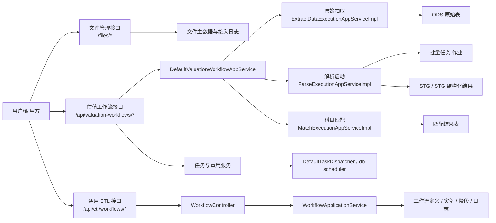
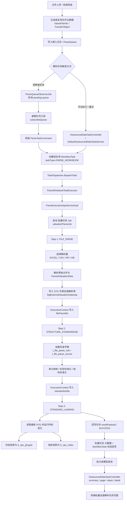

# valset-standardizer 技术设计说明

## 1. 文档目的

本文档用于说明 `valset-standardizer` 当前实现的技术设计、模块边界、核心流程、数据模型、接口协议和运行机制，作为后续评审、排障和功能扩展的基线。

本文所述内容以当前仓库代码为准，优先描述“现在如何工作”，而不是历史方案。

## 2. 项目定位

`valset-standardizer` 是一个面向外部估值表的标准化处理平台，核心目标不是单纯解析 Excel 或 CSV，而是完成一条可追溯、可回放、可复用的数据处理流水线。

整体流程可以概括为：

1. 文件接入与文件主数据登记
2. 原始文件抽取到 ODS
3. 基于 ODS 的结构化解析
4. 外部估值数据标准化
5. 外部科目与内部标准科目的匹配
6. 文件、任务、解析结果的多维查询

这套实现更接近“模块化单体 + 轻量任务编排 + 分层数据落地”，而不是微服务拆分架构。

## 3. 设计原则

### 3.1 文件和任务解耦

文件主数据独立存在，任务只描述一次处理行为。文件和任务可以关联，但不互相替代。

### 3.2 ODS 先行

原始文件先抽取到 ODS，再在结构化层做解析和标准化。这样便于重放、排障和审计。

### 3.3 编排与执行分离

调度层负责触发和状态推进，应用层负责业务处理，数据访问层负责持久化。

### 3.4 估值内部流程与通用 ETL 平台分离

估值内部解析、标准化、匹配流程与通用 ETL 工作流平台并行存在，但控制面和语义边界分开，不混用。

## 4. 总体架构

## 5. 模块边界

### 5.1 `valset-standardizer-api`

公共契约层，负责承载领域枚举、通用模型和网关接口，例如：

- `TaskType`
- `TaskStatus`
- `TaskStage`
- 各类 `Gateway` 接口

这一层不负责控制器、不负责具体表实现，也不直接执行业务逻辑。

### 5.2 `valset-standardizer`

整合应用层，负责：

- Spring Boot 启动
- REST 控制器
- 估值工作流编排
- 文件管理查询
- 运行时配置装配

### 5.3 `valset-standardizer-tools/extract`

负责原始文件抽取和 ODS 落库：

- 识别数据源类型
- 读取 Excel / CSV
- 把原始行写入 ODS
- 维护抽取任务结果和耗时

### 5.4 `valset-standardizer-tools/parser`

负责解析任务启动、待解析队列、解析规则管理和 批量任务 作业编排：

- `t_parse_queue` 的读写
- 解析任务启动
- 规则发布、回滚、校验
- 批量任务 作业上下文传递

### 5.5 `valset-standardizer-tools/knowledge`

负责标准科目、历史映射提示和样本知识加载，供匹配和评估流程复用。

### 5.6 `valset-standardizer-tools/task`

负责估值任务读模型和任务页面能力：

- 任务列表
- 任务总览
- 任务详情
- 步骤回放

该模块主要读取 批量任务 元数据，并拼装旧任务视图。

### 5.7 `valset-standardizer-tools/batch`

负责 db-scheduler 调度和任务分派：

- 定时扫描
- 立即触发
- 任务执行锁
- 路由到具体 `TaskExecutor`

### 5.8 `valset-standardizer-tools/transfer`

负责文件来源、路由、标签、投递、接入检查点：

- `t_transfer_object`
- `t_transfer_source`
- `t_transfer_route`
- `t_transfer_tag`
- `t_transfer_delivery_record`
- `t_transfer_source_checkpoint*`

### 5.9 `valset-standardizer-tools/file`

负责文件主数据视图、接入日志和 sheet 样式快照查询。

### 5.10 `valset-standardizer-tools/workflow/taskflow-adapter`

通用 ETL 平台适配层，负责：

- 工作流定义
- 工作流实例
- 阶段
- 阶段日志
- 平台绑定

## 6. 核心业务流程

### 6.1 文件接入

入口主要是：

- `POST /api/valuation-workflows/upload`
- `POST /api/files/upload`

处理步骤：

1. 上传文件进入文件存储环节。
2. 计算文件指纹。
3. 写入或复用文件主数据。
4. 写入接入日志。
5. 触发原始抽取任务。

关键点：

- 文件主数据优先通过 `t_transfer_object` 管理。
- `fileId` 是任务关联键，不是文件路径本身。
- 文件内容读取优先走 `localTempPath` / `realStoragePath`。

### 6.2 原始抽取

抽取由 `ExtractDataExecutionAppServiceImpl` 负责，处理逻辑是：

1. 从任务中读取入参。
2. 确认数据源类型。
3. 校验 `workbookPath` 可读。
4. 选择对应 `RawDataExtractor`。
5. 把原始行写入 ODS。
6. 回写任务结果和耗时。

原始抽取的主要职责是“保留事实数据”，不是做业务推断。

### 6.3 解析启动

解析由 `ParseExecutionAppServiceImpl` 负责，它本身不执行业务解析，而是：

1. 读取任务上下文。
2. 组装 `JobParameters`。
3. 提交 批量任务 作业。
4. 把 Batch 执行结果同步回旧任务模型。

真正的解析逻辑在 批量任务 step 中完成。

### 6.4 结构化解析与标准化

解析链路的目标是把 ODS 原始行恢复成结构化模型，并进一步生成标准化结果。

输出通常包括：

- 标题信息
- 基础信息
- 表头
- 多层表头
- 科目行
- 指标行
- STG 解析快照

这部分结果供匹配阶段和查询接口复用。

### 6.5 科目匹配

匹配由 `MatchExecutionAppServiceImpl` 负责，核心步骤是：

1. 读取任务入参。
2. 优先加载标准化落地结果。
3. 如果没有标准化结果，则回退到 STG 或解析器。
4. 加载标准科目和历史映射提示。
5. 构建匹配上下文。
6. 执行匹配算法。
7. 持久化匹配结果。

匹配阶段的主要优化方向是“尽量复用已标准化结果”，减少重复解析。

### 6.6 查询

文件与任务查询能力分开设计：

- 文件维度：`/files/*`
- 估值工作流维度：`/api/valuation-workflows/*`
- 任务维度：`/api/tasks/{taskId}` 和任务页
- 通用 ETL 维度：`/api/etl/workflows/*`

这样可以把“文件”“任务”“工作流定义”三个概念分开治理。

### 6.7 批量估值解析任务

批量估值解析任务不是一个独立引擎，而是围绕 `PARSE_WORKBOOK` 任务、批量任务 作业 `valuationParseJob` 和 `ParseQueue` 观察器串起来的一条批处理流水线。

这条链路里的关键职责分工如下：

1. `ParseQueueObserverJob` 负责自动发现待解析事件，并把 `ParseQueue` 转成可执行的 `ParseTaskCommand`。
2. `DefaultOutsourcedDataTaskService` 负责页面侧的单任务执行、重试、停止和批量操作，但底层仍然复用同一条解析执行链。
3. `ParseExecutionAppServiceImpl` 只负责启动 批量任务 作业，不直接承载业务解析。
4. `ParseBatchStepSupport` 承载三段式真实业务处理：
   - `FILE_PARSE`：读取原始文件，选择解析器，生成 `ParsedValuationData`，写入 STG 解析快照。
   - `STRUCTURE_STANDARDIZE`：加载 `t_file_parse_rule` 和 `t_file_parse_source`，完成表头、科目、指标标准化。
   - `STANDARD_LANDING`：把标准化结果投影到 `tr_spv_jjhzgzb` 和 `tr_spv_index`，并回写任务结果。
5. `OutsourcedDataTaskController` 和任务页只消费 批量任务 元数据与任务读模型，用于展示、查询和人工控制。

从数据层看，这条链路会形成四层产物：

- `STG` 保存原始解析事实
- 标准化 STG 保存标准化事实
- `tr_spv_jjhzgzb` 保存科目/持仓类业务结果
- `tr_spv_index` 保存指标类业务结果

从任务层看，这条链路会形成三类状态：

- `ParseQueue` 负责投递完成后的待解析事件状态
- `WorkflowTask` 负责任务执行状态、耗时和结果摘要
- 批量任务 元数据负责步骤回放和历史执行轨迹

从字段来源看，这条链路主要遵循以下规则：

- `basicInfo` 用于机构、产品、业务日期等公共字段兜底
- `subjects` 主要驱动 `tr_spv_jjhzgzb`
- `metrics` 主要驱动 `tr_spv_index`
- `fileNameOriginal`、`sourceTp`、`sourceSign` 用于贯穿三层表的溯源

因此，批量估值解析任务本质上是一条“原始文件抽取 -> 结构化解析 -> 字段标准化 -> 业务落地 -> 任务回写”的离线 ETL 流水线。

## 7. 接口设计

### 7.1 文件管理接口

控制器：`FileManagementController`

主要接口：

- `POST /files/upload`
- `GET /files/{fileId}`
- `GET /files/by-path`
- `GET /files`
- `GET /files/{fileId}/ingest-logs`
- `GET /files/by-path/ingest-logs`
- `GET /files/{fileId}/sheet-styles`
- `GET /files/by-path/sheet-styles`
- `POST /files/repair-from-transfer`

### 7.2 估值工作流接口

由 `ValuationWorkflowController` 暴露，核心能力是：

- 上传并抽取
- 解析
- 匹配
- 一次性全流程执行
- 原始数据查询
- STG 查询
- STG 查询
- 匹配结果查询
- 单任务查询

### 7.3 任务接口

任务页由 `OutsourcedDataTaskController` 暴露：

- 总览
- 分页列表
- 详情
- 步骤列表
- 单任务执行
- 单任务重试
- 单任务停止
- 批量执行 / 批量重试 / 批量停止

### 7.4 通用 ETL 接口

控制器：`WorkflowController`

主要接口：

- 工作流定义新增/查询/同步/上下线/删除
- 实例触发/停止/暂停/恢复/重试
- 实例查询
- 任务实例查询
- 阶段日志查询
- 回调

## 8. 数据模型设计

### 8.1 文件主数据层

核心表：

- `t_transfer_object`
- `t_transfer_object_tag`
- `t_valset_file_ingest_log`

职责：

- 文件身份
- 文件来源
- 文件状态
- 文件指纹
- 路径和存储信息
- 接入日志

关键字段示意：

- `transferId`
- `sourceId`
- `sourceType`
- `sourceCode`
- `fingerprint`
- `localTempPath`
- `realStoragePath`
- `status`
- `receivedAt`
- `storedAt`
- `routeId`
- `errorMessage`
- `fileMetaJson`

### 8.2 原始数据层 ODS

核心表：

- `t_ods_valuation_filedata`
- `t_ods_valuation_sheet_style`

职责：

- 保存 Excel / CSV 原始行
- 保存 sheet 级样式快照
- 为后续解析和排障提供事实来源

### 8.3 结构化结果层

典型表：

- `t_stg_external_valuation*`
- `tr_spv_jjhzgzb`
- `tr_spv_index`

职责：

- 存放结构化解析结果
- 存放标准化结果
- 作为匹配阶段输入

### 8.4 匹配结果

匹配明细不再落独立结果表，任务执行只保留摘要、阶段耗时和标准落地结果。

### 8.5 解析队列层

核心表：

- `t_parse_queue`

职责：

- 管理待解析事件
- 记录订阅、重试、完成、失败等状态
- 连接投递链路和解析链路

### 8.6 任务运行层

任务执行状态主要依赖：

- `BATCH_JOB_EXECUTION`
- `BATCH_JOB_EXECUTION_PARAMS`
- `BATCH_STEP_EXECUTION`

这里负责任务级状态、参数回放和阶段级耗时。

### 8.7 通用 ETL 层

核心表：

- `t_etl_workflow_definition`
- `t_etl_workflow_instance`
- `t_etl_workflow_stage`
- `t_etl_workflow_engine_binding`

职责：

- 统一工作流定义、实例、阶段、平台绑定和状态回读

## 9. 调度与运行机制

### 9.1 db-scheduler

用于估值内部任务和 transfer 侧的周期扫描、立即触发和延迟处理。

特点：

- 轻量
- 适合周期扫描和重试
- 与任务分发解耦

### 9.2 批量任务

用于解析作业的阶段化执行。

特点：

- 适合多阶段作业
- 便于读取执行上下文和步骤结果
- 便于和任务读模型做状态同步

### 9.3 任务分发

`DefaultTaskDispatcher` 会：

1. 读取任务
2. 锁定执行权
3. 按 `TaskType` 找到对应执行器
4. 更新任务状态
5. 记录成功或失败负载
6. 发布任务生命周期事件

### 9.4 任务复用

同一份文件、同一阶段的成功任务可以复用，除非显式要求 `forceRebuild=true`。

这样可以减少重复抽取和重复解析。

## 10. 异常与可观测性

### 10.1 任务失败结构化

任务失败不再只返回原始异常文本，而是使用结构化失败信息，通常包含：

- `taskType`
- `errorCode`
- `errorMessage`
- `rootCauseMessage`
- `errorType`

### 10.2 文件层错误

文件管理和抽取层会记录：

- 文件不存在
- 文件不可读
- 不支持的数据源类型
- 路径缺失

### 10.3 解析层错误

解析层重点关注：

- ODS 里没有可解析数据
- 表头不匹配
- 规则执行失败
- 文件内容与模板不一致

### 10.4 匹配层错误

匹配层重点关注：

- 标准科目为空
- 历史映射提示为空
- 候选集不足
- 匹配策略执行异常

## 11. 幂等与复用

### 11.1 文件指纹

文件指纹用于判断“是否同一份文件”，用于去重和复用。

### 11.2 路径优先

系统实际读取文件时优先使用 `localTempPath` / `realStoragePath`，而不是把 `fileId` 当作文件路径入口。

### 11.3 任务复用

如果同一阶段已有成功任务，默认复用旧结果，减少重复执行。

### 11.4 检查点

`transfer` 侧通过 checkpoint 和 checkpoint item 记录扫描游标和已处理条目，防止重复收取和重复分拣。

## 12. 扩展点

### 12.1 文件接入渠道

当前文件接入已经支持手动上传，并且 `transfer` 层预留了邮件、对象存储、本地目录和 SFTP 等来源能力。

### 12.2 解析规则

`parser` 侧的规则管理和 批量任务 作业天然适合继续扩展更多模板和更多结构化解析策略。

### 12.3 匹配策略

`knowledge` 和 `match` 层可以继续扩展：

- 历史映射提示
- 权重策略
- 置信度分类
- 人工复核队列

### 12.4 通用 ETL 平台

`workflow/taskflow-adapter` 已经把定义、实例、阶段、日志和平台绑定抽象出来，后续可以继续接入更多执行平台。

## 13. 非目标

当前设计不建议做的事情：

- 把估值内部流程拆成多个外部微服务
- 把文件路径和文件身份混为一谈
- 把通用 ETL 平台语义塞进估值内部 parse-task 模型
- 让解析模块直接回读原始文件而绕过 ODS

## 14. 推荐阅读顺序

如果你准备继续深入，建议按这个顺序看：

1. `docs/valuation-workflow-api.md`
2. `docs/file-management-design.md`
3. `docs/ods-parser-architecture.md`
4. `docs/workflow-engine-internal-scope.md`
5. `docs/etl-platform-design.md`
6. `docs/valuation-workflow-db-init.md`

## 15. 结论

当前项目的技术设计核心可以概括为一句话：

**以文件主数据为入口，以 ODS 为原始事实层，以 批量任务 为解析执行模型，以 db-scheduler 为轻量分发和调度模型，以文件治理和通用工作流平台为两条独立的扩展线。**
