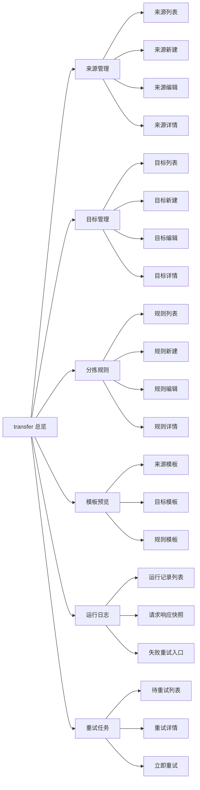

# transfer 前端原型设计文档

## 1. 背景

`tools/transfer` 已经具备一套完整的文件收发分拣能力，覆盖：

- 来源收取
  - 本地目录
  - 邮件
  - S3
  - SFTP
- 路由识别
  - 规则脚本
  - 插件化识别
  - 按文件类型、文件名、邮件发件人、邮件收件人分组路由
- 目标投递
  - 邮件
  - S3
  - SFTP
  - yss-filesys
- 调度和运行
  - db-scheduler 定时扫描
  - 投递日志
  - 失败重试
- 安全能力
  - 通道敏感配置加解密
  - 前端接口脱敏返回

当前需要补的是一套前端原型设计，用于支撑后续管理后台页面落地。该原型的核心目标不是一次性做成完整大屏，而是先把“来源、目标、规则、模板、运行日志”五个管理面串起来，确保配置人员可以完成闭环操作。

## 2. 原型设计目标

1. 让用户能够创建和维护来源、目标和分拣规则。
2. 让用户能够按类型自动选择表单模板，降低配置成本。
3. 让用户能够直观看到规则分组、目标映射和敏感字段脱敏效果。
4. 让用户能够查看投递日志、重试结果和错误原因。
5. 让前端页面与后端接口保持一一对应，降低联调成本。

## 3. 原型范围

### 3.1 一期建议覆盖

- 来源模板选择
- 目标管理
- 规则管理
- 表单 schema 预览
- 分组路由配置
- 投递日志列表
- 任务运行概览
- 敏感配置脱敏展示
- 目标新增/编辑弹窗的分步 Tabs
- 规则新增/编辑弹窗的四段式配置
- 重试任务列表的批量操作
- 运行日志的快照查看和单条重试

### 3.2 原型预留但当前接口未完整落地

- 来源完整 CRUD
- 来源运行日志管理
- 来源游标和 checkpoint 详情管理
- 多路由 fan-out 配置

原型中可以先保留页面入口，但标记为“待后端接口补齐后启用”。

## 4. 信息架构

建议在前端左侧导航中将 transfer 模块单独作为一级菜单，结构如下：

- 分拣总览
- 来源管理
- 目标管理
- 分拣规则
- 标签管理
- 分拣路由
- 分拣对象
- 文件投递
- 运行日志
- 配置说明

## 5. 页面设计

### 5.1 分拣总览页

用途：

- 展示近期文件收取、路由、投递的整体状态
- 作为 transfer 模块入口

建议组件：

- 顶部概览卡
  - 来源数量
  - 目标数量
  - 启用规则数量
  - 今日成功投递数
  - 今日失败重试数
- 运行趋势图
  - 最近 7 天的收取量、投递量、失败量
- 最近任务列表
  - 来源
  - 规则
  - 目标
  - 状态
  - 错误信息
- 快捷入口
  - 新增目标
  - 新增规则
  - 查看模板

视觉建议：

- 信息密度适中，偏运营控制台风格
- 主色建议沿用现有后台系统的蓝灰系，不要做成消费类产品风格

### 5.2 来源管理页

用途：

- 管理文件来源配置
- 让用户按来源类型加载对应 schema

当前后端现状：

- 已提供来源模板名接口：
  - `GET /api/transfer-sources/template-name?sourceType=LOCAL_DIR|EMAIL|S3|SFTP`
- 当前还没有完整来源 CRUD 接口

原型建议：

- 先设计列表页和详情抽屉
- 表单页按照模板 schema 预留
- CRUD 操作按钮在原型中保留，但标注“接口待补齐”
- 列表上方建议增加黄色提示条，明确“来源完整 CRUD 接口待补齐”
- 新建按钮可以先做置灰态或弱提示态，避免评审时误解为已支持

列表字段建议：

- 来源编码
- 来源名称
- 来源类型
- 启用状态
- 轮询表达式
- 最近收取时间
- 最近错误
- 模板名
- 最近运行结果

详情/编辑字段建议：

- 来源编码
- 来源名称
- 来源类型
- 是否启用
- 轮询表达式
- 连接配置
- checkpoint 配置
- 来源扩展信息

不同来源类型应展示不同字段组：

#### 本地目录来源

- 目录路径
- 是否递归
- 是否包含隐藏文件
- 扫描数量上限

#### 邮件来源

- 协议：IMAP / IMAPS / POP3 / POP3S
- 主机
- 端口
- 用户名
- 密码
- 收件箱目录
- SSL / STARTTLS
- 限制抓取数量

#### S3 来源

- bucket
- region
- endpoint
- accessKey
- secretKey
- prefix
- 是否使用 path style

#### SFTP 来源

- host
- port
- username
- password
- privateKeyPath
- passphrase
- remoteDir
- recursive
- includeHidden
- limit

### 5.3 目标管理页

用途：

- 管理投递目标配置
- 当前已完整支持 CRUD
- 支持脱敏显示敏感字段

当前后端接口：

- `GET /api/transfer-targets`
- `GET /api/transfer-targets/{targetId}`
- `POST /api/transfer-targets`
- `PUT /api/transfer-targets/{targetId}`
- `DELETE /api/transfer-targets/{targetId}`
- `GET /api/transfer-targets/template-name?targetType=...`

列表字段建议：

- 目标编码
- 目标名称
- 目标类型
- 启用状态
- 路径模板
- 模板名
- 是否包含敏感配置
- 最近更新时间

详情/编辑页建议按照目标类型分模板：

#### 邮件目标

- 发件人
- 收件人
- 抄送
- 密送
- SMTP 主机
- 端口
- 用户名
- 密码
- 协议
- 是否认证
- 是否 STARTTLS
- 是否 SSL
- 超时时间
- 主题模板
- 正文模板
- 是否转发原邮件内容
- 是否携带原发件人

#### S3 目标

- bucket
- region
- endpoint
- accessKey
- secretKey
- 是否使用 path style
- keyPrefix

#### SFTP 目标

- host
- port
- username
- password
- privateKeyPath
- passphrase
- remoteDir
- recursive
- includeHidden
- strictHostKeyChecking
- connectTimeoutMillis
- channelTimeoutMillis

#### yss-filesys 目标

- parentId
- storageSettingId
- chunkSize

展示要求：

- 密码、accessKey、secretKey、passphrase 只显示为掩码或空白占位
- 表单回显时允许“留空表示保持原值”
- 保存后列表和详情页都不显示明文
- 目标新增/编辑建议采用弹窗加 Tabs 的方式，和你给出的原型图保持一致
- 基础信息与连接配置分离展示，能明显降低新建目标时的认知负担

### 5.4 分拣规则管理页

用途：

- 管理分拣规则
- 支持脚本规则和分组路由

当前后端接口：

- `GET /api/transfer-rules`
- `GET /api/transfer-rules/{ruleId}`
- `GET /api/transfer-rules/template-name`
- `POST /api/transfer-rules`
- `PUT /api/transfer-rules/{ruleId}`
- `DELETE /api/transfer-rules/{ruleId}`

列表字段建议：

- 规则编码
- 规则名称
- 规则版本
- 优先级
- 启用状态
- 匹配策略
- 脚本语言
- 生效区间
- 目标类型
- 目标编码
- 分组策略

详情/编辑页建议字段分组：

#### 基础信息

- 规则编码
- 规则名称
- 规则版本
- 优先级
- 启用状态
- 匹配策略
- 脚本语言
- 脚本内容
- 生效开始时间
- 生效结束时间

#### 路由配置

- 目标类型
- 目标编码
- 目标路径
- 重命名模板
- 最大重试次数
- 重试间隔秒数

#### 分组路由配置

- 分组策略
- 分组字段
- 分组表达式
- 默认目标编码
- 分组映射表

分组策略建议展示为：

- 不分组
- 按文件类型
- 按文件名称
- 按邮件发件人
- 按邮件收件人
- 自定义

分组映射表建议做成可增删表格：

- 分组值
- 目标编码

示例：

- `finance@example.com` -> `finance-filesys-archive`
- `ops@example.com` -> `ops-filesys-archive`
- 规则新增/编辑建议采用四个 Tabs：
  - 基础信息
  - 脚本配置
  - 路由配置
  - 分组配置
- 脚本配置建议预留更大的编辑区域，避免脚本被压缩成窄输入框

### 5.5 表单模板页

用途：

- 让前端根据后端 schema 动态渲染表单
- 便于统一来源/目标/规则的表单结构

当前后端接口：

- `GET /api/transfer-form-templates`
- `GET /api/transfer-form-templates/grouped`
- `GET /api/transfer-form-templates/{name}`

建议页面能力：

- 按分类查看模板
  - 来源
  - 目标
  - 规则
- 点击模板时展示：
  - 表单定义 JSON
  - 默认值
  - 预览渲染结果
  - 对应业务说明

适合前端的交互方式：

- 左侧模板列表
- 中间 schema 预览
- 右侧字段说明

### 5.6 运行日志页

用途：

- 查看每次分拣运行结果
- 定位失败原因

建议列表字段：

- 运行时间
- 来源编码
- 规则编码
- 目标编码
- 文件名
- 状态
- 重试次数
- 错误信息
- 投递结果
- 操作

筛选条件建议：

- 来源类型
- 目标类型
- 规则编码
- 状态
- 时间范围
- 文件名
- 来源编码

页面建议：

- 运行日志页的“查看快照”应打开抽屉，展示请求参数、响应参数和错误信息。
- 失败记录可直接在当前页触发重试，不必强制跳转到重试任务页。
- 列表中的“重试”动作仅对失败或待重试记录开放。

### 5.7 重试任务页

用途：

- 查看失败后自动重试的任务
- 手动触发重试

建议列表字段：

- 路由 id
- 投递 id
- 当前重试次数
- 最大重试次数
- 下次重试时间
- 失败原因
- 状态

页面动作建议：

- 立即重试
- 跳过重试
- 查看请求/响应快照

页面建议：

- 列表左侧增加勾选框，支持批量立即重试和批量跳过。
- 重试次数建议采用 `当前次数/最大次数` 的展示方式，例如 `2/5`。
- 对超过最大重试次数的任务，建议显示为“已终止”或“死信”，避免一直停留在待重试列表中。

### 5.8 配置说明页

用途：

- 给配置人员说明 transfer 的来源、目标、规则、模板之间的关系
- 解释常见字段、分组策略和敏感字段规则
- 作为新用户的首次使用指引

建议内容：

- 模块简介
- 来源类型说明
- 目标类型说明
- 分拣规则说明
- 分组策略说明
- 敏感字段说明
- 常见问题

建议页面形态：

- 左侧目录锚点
- 右侧长文说明
- 可插入示意图或字段表

建议定位：

- 它不是 CRUD 页面，而是“配置手册页”
- 原型里保留，但优先级低于目标、规则、日志页

## 6. 原型交互流程

### 6.1 新建目标

1. 点击“新建目标”。
2. 先选择目标类型。
3. 前端调用：
   - `GET /api/transfer-targets/template-name?targetType=...`
   - `GET /api/transfer-form-templates/{templateName}`
4. 按 schema 渲染表单。
5. 提交 `POST /api/transfer-targets`。
6. 提交成功后回到列表页。

### 6.2 新建规则

1. 点击“新建规则”。
2. 前端获取 `transfer_rule` schema。
3. 渲染规则基础信息、路由配置和分组配置。
4. 提交 `POST /api/transfer-rules`。
5. 保存成功后刷新列表。

### 6.3 查看敏感字段

1. 打开目标详情。
2. 页面只展示掩码字段。
3. 如果用户编辑表单，密码字段默认空白。
4. 若不修改密码，提交时保留原值。

### 6.4 查看分组路由

1. 打开规则详情。
2. 展示分组策略和分组映射表。
3. 选择某个分组值可预览其命中后的目标编码和路径模板。

## 7. 字段与后端 API 映射

### 7.1 目标管理

后端对象：

- `TransferTargetViewDTO`
- `TransferTargetUpsertCommand`

前端字段建议直接映射：

- `targetCode`
- `targetName`
- `targetType`
- `enabled`
- `targetPathTemplate`
- `connectionConfig`
- `targetMeta`

### 7.2 规则管理

后端对象：

- `TransferRuleViewDTO`
- `TransferRuleUpsertCommand`

前端字段建议直接映射：

- `ruleCode`
- `ruleName`
- `ruleVersion`
- `enabled`
- `priority`
- `matchStrategy`
- `scriptLanguage`
- `scriptBody`
- `effectiveFrom`
- `effectiveTo`
- `ruleMeta`

### 7.3 模板查询

前端只需要关注模板名：

- `transfer_source_local`
- `transfer_source_email`
- `transfer_source_s3`
- `transfer_source_sftp`
- `transfer_target_email`
- `transfer_target_s3`
- `transfer_target_sftp`
- `transfer_target_filesys`
- `transfer_rule`

## 8. 视觉与布局建议

### 8.1 视觉风格

- 偏后台管理系统风格
- 清晰、稳定、低噪声
- 不要做成消费产品那种强视觉冲击
- 表单区域和表格区域都要高可读性

### 8.2 布局建议

- 顶部：页面标题、简述、快捷入口
- 中部：筛选区 + 列表区
- 右侧：详情抽屉或编辑抽屉
- 编辑页：分段表单 + 固定底部操作栏

### 8.3 状态设计

建议统一状态色：

- 成功：绿色
- 失败：红色
- 处理中：蓝色
- 禁用：灰色
- 待重试：橙色

### 8.4 敏感字段设计

- 密码类字段用输入框 `type=password`
- 列表和详情默认不展示明文
- 若展示脱敏值，统一使用 `******`

## 9. 组件建议

建议前端抽象以下通用组件：

- `TemplateNameSelector`
- `DynamicSchemaForm`
- `SecretField`
- `RouteGroupMappingTable`
- `TransferStatusTag`
- `TransferLogDrawer`
- `JsonPreviewPanel`
- `EndpointBadge`

这样来源、目标、规则三类页面可以共用大量组件。

## 10. 原型交付建议

建议前端原型分三层交付：

1. 线框图
   - 先确定信息架构、字段和页面结构
2. 高保真原型
   - 再确定视觉风格、表单布局和弹窗抽屉样式
3. 接口联调版
   - 对接当前后端 API，验证表单模板和 CRUD 流程

## 11. 推荐一期原型优先级

### P0

- 目标管理页
- 规则管理页
- 模板预览页

### P1

- 来源管理页
- 总览页
- 运行日志页

### P2

- 重试任务页
- 来源运行日志页
- 规则版本管理

## 12. 当前后端接口已可直接支撑的部分

以下页面可以直接按现有接口原型化：

- 目标管理页
- 分拣规则管理页
- 表单模板页
- 分组映射配置页

以下页面建议先做原型预留，后续补接口再联调：

- 来源管理页完整 CRUD
- 运行日志页
- 重试任务页

## 13. 结论

这套 transfer 前端原型的重点不是把所有细节一次性做完，而是建立一条清晰的配置链：

来源选择 -> 模板加载 -> 目标配置 -> 规则配置 -> 分组映射 -> 投递结果 -> 日志追踪。

按这个结构做，前端后续即使增加新的来源类型、目标类型或分组维度，也只需要新增模板和少量 schema 配置，不需要重写页面骨架。

## 14. 页面级线框说明

本节给前端原型直接使用，按“页面区域 -> 组件 -> 交互”的方式描述。

### 14.1 分拣总览页

#### 页面结构

- 顶栏
  - 页面标题：分拣总览
  - 说明文本：查看来源、规则、目标和运行情况
  - 操作按钮：刷新、查看模板、查看运行日志
- 第一行概览卡
  - 已启用来源
  - 已启用目标
  - 已启用规则
  - 今日成功投递
  - 今日失败重试
- 第二行趋势图
  - 收取量趋势
  - 投递量趋势
  - 失败量趋势
- 第三行最近运行表
  - 运行时间
  - 来源编码
  - 规则编码
  - 目标编码
  - 文件名
  - 状态
  - 错误信息
  - 操作：查看详情

#### 交互

- 点击某条运行记录，打开右侧抽屉查看详情。
- 点击“查看模板”，跳转到模板页。
- 点击“查看运行日志”，跳转到运行日志页。
- 点击“查看全部”时可跳转到运行日志或重试任务页。

### 14.2 来源管理页

#### 页面结构

- 顶栏
  - 页面标题：来源管理
  - 操作按钮：新建来源、刷新
- 说明条
  - 当前仅保留列表和原型入口
  - 新建、编辑、删除先作为视觉占位
- 筛选区
  - 来源编码
  - 来源名称
  - 来源类型
  - 启用状态
- 列表区
  - 来源编码
  - 来源名称
  - 来源类型
  - 轮询配置
  - 最近收取时间
  - 状态
  - 操作：查看、编辑、停用、删除
- 右侧抽屉或弹窗
  - 基础信息
  - 连接配置
  - checkpoint 配置
  - 来源扩展信息

#### 建议

- 采用列表 + 抽屉查看的方式，避免列表页信息过长。
- 列表中“最近收取时间”和“最近错误”是运维最关注字段，建议靠前展示。
- 若后端尚未补齐 CRUD，按钮应保留但加“待接口补齐”的状态说明。

#### 交互

- 选择来源类型后，自动调用模板接口并刷新表单字段。
- 若后端未提供完整 CRUD，原型中可先以“表单预览”方式展示。
- 敏感字段默认脱敏，不允许在详情页直接明文查看。

### 14.3 目标管理页

#### 页面结构

- 顶栏
  - 页面标题：目标管理
  - 操作按钮：新建目标、刷新
- 新建/编辑弹窗
  - Tab 1：基础信息
  - Tab 2：连接配置
- 筛选区
  - 目标编码
  - 目标名称
  - 目标类型
  - 启用状态
- 列表区
  - 目标编码
  - 目标名称
  - 目标类型
  - 路径模板
  - 最近更新时间
  - 操作：查看、编辑、删除
- 右侧抽屉或编辑页
  - 目标基础信息
  - 连接配置
  - 目标扩展配置
  - 敏感字段掩码展示

#### 建议

- 新建目标建议采用弹窗 + Tab 的方式，和图片原型保持一致。
- 列表里增加“最近投递结果摘要”会更利于判断目标是否正常。
- 敏感字段一律不回显明文，编辑页留空表示保持原值。

#### 交互

- 选择目标类型后，调用模板名接口加载对应 schema。
- 密码、accessKey、secretKey、passphrase 以掩码展示。
- 编辑时如果密码字段留空，默认保留旧值。

### 14.4 分拣规则管理页

#### 页面结构

- 顶栏
  - 页面标题：分拣规则管理
  - 操作按钮：新建规则、刷新
- 新建规则弹窗
  - Tab 1：基础信息
  - Tab 2：脚本配置
  - Tab 3：路由配置
  - Tab 4：分组配置
- 筛选区
  - 规则编码
  - 启用状态
  - 目标类型
  - 分组策略
- 列表区
  - 规则编码
  - 规则名称
  - 优先级
  - 启用状态
  - 分组策略
  - 目标类型
  - 目标编码
  - 操作：查看、编辑、删除
- 右侧抽屉或编辑页
  - 基础信息
  - 脚本配置
  - 路由配置
  - 分组配置

#### 建议

- 规则页最重要的是把“脚本”和“分组路由”并列出来，避免把路由逻辑藏进 JSON。
- 分组映射表建议做成可增删行表格。
- 列表中建议直接展示“分组策略”，便于一眼看懂规则用途。

#### 交互

- 点击规则详情，查看脚本内容和分组映射表。
- 分组映射表支持新增和删除行。
- 脚本编辑区支持代码高亮和简单语法校验提示。

### 14.5 模板预览页

#### 页面结构

- 左侧模板分类树
  - 来源
  - 目标
  - 规则
- 中间模板列表
  - 模板名
  - 模板说明
  - 版本
- 右侧预览区
  - schema JSON
  - 默认值 JSON
  - 字段渲染预览

#### 交互

- 点击模板条目，右侧同步预览。
- 点击“复制 schema”，复制给开发或联调用。
- 点击“使用此模板”，进入对应实体的新建页面。

### 14.6 运行日志页

#### 页面结构

- 顶栏
  - 页面标题：运行日志
  - 操作按钮：刷新、导出
- 筛选区
  - 时间范围
  - 来源类型
  - 规则编码
  - 目标类型
  - 状态
- 列表区
  - 运行时间
  - 文件名
  - 来源编码
  - 规则编码
  - 目标编码
  - 重试次数
  - 状态
  - 操作：查看快照、重试

#### 建议

- 运行日志页应支持时间范围、来源类型、规则编码、目标类型、状态、文件名筛选。
- “查看快照”建议打开抽屉，展示请求参数、响应参数和错误信息。
- 列表中的“重试”动作仅对失败或待重试记录开放。

#### 交互

- 查看快照时打开请求/响应抽屉。
- 失败记录支持一键重试。
- 重试前提示当前重试次数和最大重试次数。

### 14.7 重试任务页

#### 页面结构

- 顶栏
  - 页面标题：重试任务
  - 操作按钮：立即重试、跳过重试、刷新
- 筛选区
  - 路由 ID
  - 投递 ID
  - 状态
  - 重试次数
- 列表区
  - 复选框
  - 路由 ID
  - 投递 ID
  - 当前重试次数
  - 最大重试次数
  - 下次重试时间
  - 失败原因
  - 状态
  - 操作：立即重试、跳过重试、查看详情

#### 交互

- 支持批量选择后执行立即重试或跳过重试。
- 单条任务支持立即重试。
- 详情页建议同时展示请求快照、响应快照和最近失败原因。
- 对超过最大重试次数的任务，建议标识为“已终止”或“死信”。

## 15. 原型字段状态规范

### 15.1 只读状态

以下字段在详情页应为只读：

- 来源编码
- 目标编码
- 规则编码
- 规则版本
- 最近运行状态
- 最近错误信息

### 15.2 可编辑状态

以下字段在编辑页可编辑：

- 来源名称
- 目标名称
- 启用状态
- 轮询表达式
- 连接配置
- 分组配置
- 脚本内容
- 目标路径模板

### 15.3 保留原值状态

以下字段允许空值表示“保留原值”：

- 密码
- accessKey
- secretKey
- passphrase

## 16. 原型验收标准

一个可交付的 transfer 前端原型，至少应满足以下要求：

1. 能从目标类型或来源类型自动加载模板。
2. 能在页面中展示规则脚本和分组映射。
3. 能在详情页看到脱敏后的敏感配置。
4. 能从运行日志追踪到文件、规则和目标。
5. 能体现新增、编辑、删除、查看、刷新这几类核心动作。

如果这五项都具备，这份原型就足够支撑前端正式开发，不必等所有后端接口一次性做完。

## 17. 组件级拆分建议

这一节用于把页面进一步拆成前端可复用组件，避免后续出现页面间重复搭积木的情况。

### 17.1 通用组件

#### `PageHeaderBar`

用途：

- 页面标题
- 说明文本
- 右侧操作按钮

建议字段：

- `title`
- `description`
- `actions`

#### `FilterFormBar`

用途：

- 列表页顶部筛选区

建议字段：

- `items`
- `onSearch`
- `onReset`

#### `StatusTag`

用途：

- 统一显示启用、禁用、成功、失败、待重试等状态

建议映射：

- `ENABLED`
- `DISABLED`
- `SUCCESS`
- `FAILED`
- `PENDING`
- `RETRYING`

#### `SecretField`

用途：

- 显示敏感字段掩码
- 编辑时允许留空保留旧值

建议行为：

- 展示：`******`
- 编辑：输入框类型为 `password`
- 清空：不覆盖原值

#### `JsonSchemaPreview`

用途：

- 展示表单 schema 和默认值
- 提供复制功能

#### `SideDetailDrawer`

用途：

- 列表项详情查看
- 运行记录详情查看

#### `ActionConfirmModal`

用途：

- 删除确认
- 重试确认
- 停用确认

### 17.2 页面专属组件

#### 来源管理页

- `SourceTypeCard`
- `SourceConnectionEditor`
- `SourceCheckpointEditor`
- `SourceTemplateLoader`

#### 目标管理页

- `TargetTypeCard`
- `TargetConnectionEditor`
- `TargetMetaEditor`
- `TargetTemplateLoader`

#### 规则管理页

- `RuleScriptEditor`
- `RuleRouteConfigEditor`
- `RuleGroupMappingTable`
- `RuleTemplateLoader`

#### 运行日志页

- `TransferLogTable`
- `TransferLogSnapshotDrawer`
- `RetryStatusBadge`

## 18. 数据契约建议

为了让前端原型尽快落地，建议后端返回的数据结构尽量稳定，前端只依赖以下字段。

### 18.1 来源列表数据

```json
{
  "sourceId": 1,
  "sourceCode": "email-daily",
  "sourceName": "日报邮箱",
  "sourceType": "EMAIL",
  "enabled": true,
  "pollCron": "0 */5 * * * ?",
  "formTemplateName": "transfer_source_email",
  "connectionConfig": {},
  "sourceMeta": {}
}
```

### 18.2 目标列表数据

```json
{
  "targetId": 1,
  "targetCode": "filesys-archive",
  "targetName": "文件服务归档",
  "targetType": "FILESYS",
  "enabled": true,
  "targetPathTemplate": "/archive/${yyyyMMdd}",
  "formTemplateName": "transfer_target_filesys",
  "connectionConfig": {},
  "targetMeta": {}
}
```

### 18.3 规则列表数据

```json
{
  "ruleId": 1,
  "ruleCode": "EMAIL_ATTACHMENT_GROUP_BY_SENDER",
  "ruleName": "按发件人分组路由",
  "ruleVersion": "1.0.0",
  "enabled": true,
  "priority": 10,
  "matchStrategy": "SCRIPT_RULE",
  "scriptLanguage": "qlexpress4",
  "formTemplateName": "transfer_rule",
  "ruleMeta": {}
}
```

### 18.4 运行记录数据

```json
{
  "runId": 1,
  "sourceCode": "email-daily",
  "ruleCode": "EMAIL_ATTACHMENT_GROUP_BY_SENDER",
  "targetCode": "filesys-archive",
  "fileName": "report.xlsx",
  "status": "SUCCESS",
  "retryCount": 0,
  "errorMessage": null,
  "createdAt": "2026-04-21T10:00:00"
}
```

## 19. 原型页面跳转关系

建议原型图中明确标出页面跳转路径，减少前端开发时的猜测成本。

### 19.1 从总览页出发

- 点击“来源管理” -> 来源管理页
- 点击“目标管理” -> 目标管理页
- 点击“分拣规则” -> 分拣规则管理页
- 点击“模板预览” -> 模板预览页
- 点击“运行日志” -> 运行日志页

### 19.2 从列表页出发

- 点击“查看” -> 详情抽屉
- 点击“编辑” -> 编辑页或编辑抽屉
- 点击“删除” -> 删除确认弹窗
- 点击“重试” -> 重试确认弹窗

### 19.3 从模板页出发

- 点击“使用此模板” -> 新建来源 / 新建目标 / 新建规则页面

## 20. 原型标注建议

为了便于后续评审，建议每张原型图都带上以下标注：

- 页面名称
- 接口名称
- 关键字段
- 是否已落地
- 是否敏感字段
- 交互备注

例如：

- `已落地`：后端接口已经存在
- `待补齐`：仅保留原型入口

## 21. 结论补充

如果把这份原型继续往下推进，建议下一步不是再加抽象概念，而是直接画三类图：

1. 总览页 + 路由页
2. 目标编辑页 + 分组配置页
3. 规则编辑页 + 模板预览页

这三类图足够让前端、后端和产品一起对齐 transfer 模块的第一版管理后台。

## 22. Figma 页面清单建议

如果后续要在 Figma 里直接开稿，建议按照下面的页面树组织。

### 22.1 页面树

- `transfer / 总览`
- `transfer / 来源管理`
  - `transfer / 来源管理 / 列表`
  - `transfer / 来源管理 / 新建`
  - `transfer / 来源管理 / 编辑`
  - `transfer / 来源管理 / 详情`
- `transfer / 目标管理`
  - `transfer / 目标管理 / 列表`
  - `transfer / 目标管理 / 新建`
  - `transfer / 目标管理 / 编辑`
  - `transfer / 目标管理 / 详情`
- `transfer / 分拣规则`
  - `transfer / 分拣规则 / 列表`
  - `transfer / 分拣规则 / 新建`
  - `transfer / 分拣规则 / 编辑`
  - `transfer / 分拣规则 / 详情`
- `transfer / 模板预览`
- `transfer / 运行日志`
- `transfer / 重试任务`

### 22.2 页面命名规范

建议统一采用“模块 / 功能 / 状态”的命名方式，便于后续查找与协作：

- `列表`
- `新建`
- `编辑`
- `详情`
- `预览`

如果要加状态区分，可以继续附加：

- `空状态`
- `加载中`
- `错误态`
- `无权限态`

## 23. 字段清单建议

这一节用于把页面和表单要展示的字段一次性列清楚，避免后续漏字段。

### 23.1 来源字段清单

- 来源编码
- 来源名称
- 来源类型
- 是否启用
- 轮询表达式
- 连接配置
- checkpoint 配置
- 来源扩展信息
- 最近收取时间
- 最近错误信息

### 23.2 目标字段清单

- 目标编码
- 目标名称
- 目标类型
- 是否启用
- 路径模板
- 连接配置
- 目标扩展信息
- 最近更新时间

### 23.3 规则字段清单

- 规则编码
- 规则名称
- 规则版本
- 是否启用
- 优先级
- 匹配策略
- 脚本语言
- 脚本内容
- 生效开始时间
- 生效结束时间
- 目标类型
- 目标编码
- 目标路径
- 重命名模板
- 最大重试次数
- 重试间隔秒数
- 分组策略
- 分组字段
- 分组表达式
- 分组映射表
- 默认目标编码

### 23.4 日志字段清单

- 运行时间
- 来源编码
- 规则编码
- 目标编码
- 文件名
- 状态
- 重试次数
- 请求快照
- 响应快照
- 错误信息

## 24. 前端实现任务拆分

如果要把原型进一步落地成代码，建议按下面的任务拆分。

### 24.1 基础能力

1. 建立 transfer 模块路由
2. 建立 transfer 菜单入口
3. 建立统一的列表页模板
4. 建立统一的抽屉表单模板
5. 建立统一的 JSON 预览组件

### 24.2 接口联动

1. 接入来源模板名接口
2. 接入目标模板名接口
3. 接入规则模板接口
4. 接入来源列表和详情接口
5. 接入目标 CRUD 接口
6. 接入规则 CRUD 接口

### 24.3 表单体验

1. 按目标类型动态加载 schema
2. 按来源类型动态加载 schema
3. 对敏感字段做掩码和保留原值处理
4. 对分组映射表做增删行处理
5. 对脚本编辑器做基础校验和高亮

### 24.4 运营能力

1. 做运行日志列表
2. 做失败快照抽屉
3. 做重试动作入口
4. 做总览趋势图和统计卡

## 25. 设计评审检查项

建议在原型评审时逐项检查：

1. 来源、目标、规则三类页面是否风格统一。
2. 模板加载是否依赖后端 schema，而不是前端写死字段。
3. 敏感字段是否默认脱敏。
4. 分组配置是否足够直观。
5. 日志页是否能支撑排障。
6. 空状态、错误态、加载态是否都考虑到。
7. 原型页面是否能对齐现有接口，不出现虚构字段。

## 26. 最终建议

如果你打算继续往下做，最有效的推进顺序是：

1. 先画 `目标管理` 和 `分拣规则管理` 两页。
2. 再补 `模板预览` 页。
3. 然后补 `运行日志` 页。
4. 最后再补 `来源管理` 页。

原因很直接：

- 目标和规则是当前已经最完整、最可交互的能力。
- 模板页能帮助前端快速对齐 schema。
- 日志页能证明整条链路闭环。
- 来源页虽然重要，但当前接口完整度还不如目标和规则高，适合放在后面做。

## 27. Figma 页面结构图

下面这张结构图可以直接作为 Figma 原型的页面导航骨架，也适合拿去做评审说明。



### 27.1 页面树建议

- transfer 总览
  - 来源管理
    - 列表
    - 新建
    - 编辑
    - 详情
  - 目标管理
    - 列表
    - 新建
    - 编辑
    - 详情
  - 分拣规则
    - 列表
    - 新建
    - 编辑
    - 详情
  - 标签管理
  - 分拣路由
  - 分拣对象
  - 文件投递
  - 运行日志

### 27.2 页面联动关系

- 总览页负责承接所有入口。
- 来源、目标、规则三类页面共享模板加载能力。
- 模板预览页负责展示 schema 和默认值。
- 运行日志页和重试任务页负责排障和运维。
- 目标管理页与规则管理页是原型的核心交互页，建议优先出高保真图。

### 27.3 建议的 Figma 画法

1. 先画一个总览页作为导航中枢。
2. 再分别画来源、目标、规则三类核心页。
3. 然后补标签、路由、对象查询和投递查询页。
4. 最后补运行日志页。
5. 每个页面都复用同一套页面头部、筛选区、列表区、抽屉区。
6. 用连线或注释标出跳转关系和接口名称。

## 28. 前端开发任务拆解表

下面这份拆解表适合直接放进 Jira、飞书或看板中使用。

### 28.1 基础搭建阶段

#### 任务 1：建立 transfer 模块路由

- 目标：把 transfer 功能挂到管理后台菜单树中
- 依赖：无
- 交付物：
  - 菜单入口
  - 路由页面
  - 基础权限标识

#### 任务 2：建立统一页面框架

- 目标：统一页面头部、筛选区、列表区、抽屉区
- 依赖：任务 1
- 交付物：
  - `PageHeaderBar`
  - `FilterFormBar`
  - `SideDetailDrawer`
  - `ActionConfirmModal`

#### 任务 3：建立模板查询接入层

- 目标：前端可按类型加载 schema
- 依赖：任务 1
- 交付物：
  - 模板接口封装
  - 模板加载工具
  - JSON 预览组件

### 28.2 核心页面阶段

#### 任务 4：目标管理页

- 目标：完成目标列表、新建、编辑、详情、删除
- 依赖：任务 2、任务 3
- 交付物：
  - 目标列表页
  - 目标编辑抽屉或页面
  - 敏感字段掩码
  - 类型化表单渲染

#### 任务 5：分拣规则管理页

- 目标：完成规则列表、新建、编辑、详情、删除
- 依赖：任务 2、任务 3
- 交付物：
  - 规则列表页
  - 脚本编辑区
  - 分组映射表
  - 路由配置区

#### 任务 6：模板预览页

- 目标：查看来源、目标、规则的 schema 和默认值
- 依赖：任务 3
- 交付物：
  - 模板分类树
  - 模板列表
  - schema 预览区
  - 默认值预览区

### 28.3 辅助能力阶段

#### 任务 7：来源管理页

- 目标：先做页面原型和表单预览，后续接完整 CRUD
- 依赖：任务 2、任务 3
- 交付物：
  - 来源列表页
  - 来源模板联动
  - 来源表单草稿
  - CRUD 入口占位

#### 任务 8：运行日志页

- 目标：查看投递运行记录和快照
- 依赖：任务 2
- 交付物：
  - 运行日志列表
  - 请求响应快照抽屉
  - 失败状态标签

#### 任务 9：重试任务页

- 目标：查看失败重试任务并支持立即重试
- 依赖：任务 8
- 交付物：
  - 待重试列表
  - 立即重试按钮
  - 重试确认弹窗

### 28.4 交互细化阶段

#### 任务 10：敏感字段处理

- 目标：确保密码、accessKey、secretKey 等字段不明文展示
- 依赖：任务 4、任务 7
- 交付物：
  - `SecretField`
  - 掩码展示逻辑
  - 留空保留原值逻辑

#### 任务 11：分组映射编辑

- 目标：支持规则里的分组值到目标编码的映射编辑
- 依赖：任务 5
- 交付物：
  - 分组映射表格
  - 行增删改能力
  - 默认目标兜底提示

#### 任务 12：脚本编辑体验

- 目标：提升规则脚本编辑的可读性和可维护性
- 依赖：任务 5
- 交付物：
  - 代码高亮
  - 基础语法提示
  - 常用辅助函数说明

### 28.5 推荐里程碑

- 里程碑 1：目标管理页 + 规则管理页 + 模板预览页
- 里程碑 2：来源管理页 + 运行日志页
- 里程碑 3：重试任务页 + 敏感字段能力 + 脚本体验优化

### 28.6 最小可用版本定义

如果要判断前端原型是否达到“可用”标准，至少需要满足：

1. 能新增和编辑目标。
2. 能新增和编辑规则。
3. 能按模板渲染表单。
4. 能隐藏敏感字段。
5. 能在运行日志页看见失败和重试信息。

只要这五项完成，transfer 的前端原型就可以进入正式联调。
