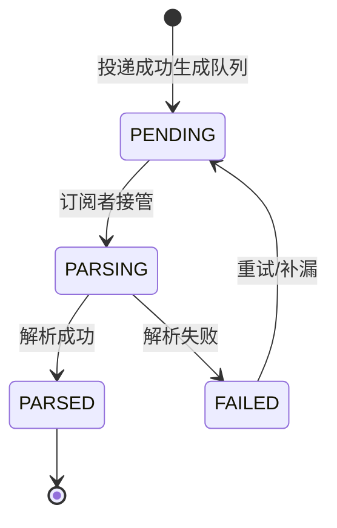
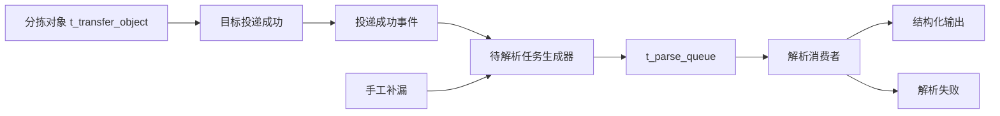

# 待解析任务队列设计

## 1. 背景

当前转移链路已经具备分拣对象、投递记录、运行日志等核心事实数据，但还缺少一层独立的“待解析任务队列”。

新的业务目标是：

- 在目标投递完成后，自动生成待解析任务
- 只针对满足条件的估值表文件生成解析任务
- 支持手工补漏，修复漏生成的队列
- 支持独立的解析状态流转
- 支持后续订阅式消费，完成结构化输出

这个能力不建议直接复用现有 `/tasks/parse` 作为唯一入口。现有解析任务接口更像低层任务创建能力，而这里需要的是一层可查询、可重试、可补漏、可消费的业务队列。

## 2. 设计目标

1. 以分拣对象为事实来源，生成待解析队列。
2. 以投递完成作为触发点，确保解析任务只在目标投递成功后出现。
3. 以独立队列表承载解析生命周期，避免对象表混入过多任务状态。
4. 支持幂等生成，避免重复投递导致重复入队。
5. 支持手工补漏和强制重建，便于运维回补。
6. 支持结构化解析消费，后续可由订阅者独立消费队列。

## 3. 业务规则

### 3.1 生成条件

只有同时满足以下条件的分拣对象才会进入待解析队列：

- 文件状态 = `已识别`
- 投递状态 = `已投递`
- 标签 = `估值表`

建议实现时优先使用稳定字段判断，例如 `tagCode` / `tagId`，页面展示时再映射为“估值表”。

### 3.2 触发时机

解析任务队列的自动生成时机为：

- 目标投递成功后

推荐在投递事务提交后通过领域事件或应用事件触发，避免投递成功但队列未落库的中间态。

### 3.3 手工补漏

支持两类补漏：

- 单条补漏：按 `transferId` 生成或重建待解析任务
- 批量补漏：按条件扫描缺失队列并批量生成

默认策略建议为：

- 只补缺，不覆盖已有有效队列
- 如需覆盖，单独提供 `forceRebuild=true`

## 4. 数据模型

### 4.1 现有事实表

#### `t_transfer_object`

作为分拣对象事实源，继续保存：

- 文件状态
- 投递状态
- 路由信息
- 标签信息
- 原始文件信息

#### `t_transfer_delivery_record`

作为投递事实源，继续保存：

- 路由主键
- 投递执行状态
- 请求快照
- 响应快照
- 错误信息

### 4.2 新增队列表

建议新增：

- `t_parse_queue`

该表作为待解析任务的唯一队列来源，不建议把解析状态散落到多个表里。

#### 建议字段

| 字段 | 说明 |
|---|---|
| `queue_id` | 队列主键 |
| `business_key` | 幂等业务键，建议由 `transferId + parseType` 组成 |
| `transfer_id` | 分拣对象主键 |
| `tag_id` | 标签主键 |
| `tag_code` | 标签编码 |
| `tag_name` | 标签名称 |
| `source_id` | 来源主键 |
| `source_type` | 来源类型 |
| `source_code` | 来源编码 |
| `route_id` | 路由主键 |
| `delivery_id` | 投递记录主键 |
| `file_status_snapshot` | 生成时文件状态快照 |
| `delivery_status_snapshot` | 生成时投递状态快照 |
| `parse_status` | `PENDING` / `PARSING` / `PARSED` / `FAILED` |
| `trigger_mode` | `AUTO` / `MANUAL` |
| `retry_count` | 重试次数 |
| `last_error_message` | 最近失败原因 |
| `claimed_by` | 当前订阅方（物理列名保留） |
| `claimed_at` | 订阅时间（物理列名保留） |
| `parsed_at` | 完成时间 |
| `object_snapshot_json` | 分拣对象快照 |
| `delivery_snapshot_json` | 投递记录快照 |
| `parse_request_json` | 解析请求上下文 |
| `parse_result_json` | 结构化输出结果 |
| `created_at` | 创建时间 |
| `updated_at` | 更新时间 |

#### 唯一约束

建议对 `business_key` 建唯一约束。

如果后续同一分拣对象可能对应多种解析类型，可以把 `parseType` 纳入业务键。

## 5. 状态设计

### 5.1 解析状态

新增解析状态建议如下：

- `PENDING`：待解析
- `PARSING`：解析中
- `PARSED`：已解析
- `FAILED`：解析失败

### 5.2 状态流转

### 5.3 状态边界

建议分开看两层状态：

- 对象事实状态：文件状态、投递状态
- 队列处理状态：解析状态

对象表不建议承担解析任务队列职责，只保留必要的展示冗余字段即可。

## 6. 触发链路

推荐链路如下：

### 6.1 自动生成

自动生成建议挂在以下位置之一：

- 投递服务成功返回后
- 投递记录落库并提交事务之后
- 投递完成领域事件的监听器中

推荐优先使用事务后事件，避免回滚场景下误建队列。

### 6.2 幂等要求

生成器必须满足：

- 同一 `business_key` 只能有一条有效队列
- 重复投递事件不应重复生成队列
- 手工补漏默认只补缺，不覆盖已存在的有效记录

## 7. 队列消费设计

### 7.1 消费方式

待解析队列建议支持两种消费方式：

- 定时扫描抢占
- 订阅式消费

先落库队列，再消费，避免解析过程直接耦合投递链路。

### 7.2 订阅规则

订阅者接管任务时建议：

- 仅接管 `PENDING`
- 接管后原子更新为 `PARSING`
- 记录 `subscribedBy` 和 `subscribedAt`，底层物理列仍沿用 `claimed_by` 和 `claimed_at`

### 7.3 失败处理

解析失败时建议：

- 更新为 `FAILED`
- 记录 `last_error_message`
- 保留 `parse_request_json` 和 `object_snapshot_json`
- 支持重试回到 `PENDING`

## 8. 手工补漏设计

建议新增补漏接口，满足以下场景：

- 历史漏单批量回补
- 某条对象的单独补生成
- 某批数据的重建

### 8.1 单条补漏

输入：

- `transferId`
- 可选 `forceRebuild`

行为：

- 查询对象事实
- 校验是否满足生成条件
- 幂等生成待解析队列

### 8.2 批量补漏

输入条件建议包括：

- `sourceId`
- `routeId`
- `deliveryStatus`
- `status`
- `tagCode`
- `createdAt` 时间范围

建议增加 `dryRun`：

- `dryRun=true` 时只返回可生成数量、已存在数量、跳过数量
- `dryRun=false` 时真正落库

## 9. 接口建议

### 9.1 队列查询

- `GET /api/transfer-parse-queues`
- `GET /api/transfer-parse-queues/{queueId}`

### 9.2 队列生成

- `POST /api/transfer-parse-queues/generate`
- `POST /api/transfer-parse-queues/backfill`

### 9.3 队列消费控制

- `POST /api/transfer-parse-queues/{queueId}/subscribe`
- `POST /api/transfer-parse-queues/{queueId}/complete`
- `POST /api/transfer-parse-queues/{queueId}/fail`
- `POST /api/transfer-parse-queues/{queueId}/retry`

### 9.4 返回规范

建议继续沿用项目现有风格：

- 单条返回用 `SingleResult`
- 列表返回用 `MultiResult`
- 分页返回用 `PageResult`

不要把队列接口退回成裸 `Map` 或裸列表。

## 10. 前端页面建议

建议新增一个“待解析任务”页面，和“分拣对象”页面分开。

### 10.1 列表字段

- 任务主键
- 分拣对象主键
- 原始文件名
- 来源编码
- 路由主键
- 标签
- 文件状态
- 投递状态
- 解析状态
- 触发方式
- 重试次数
- 创建时间
- 解析完成时间
- 错误信息

### 10.2 页面操作

- 手工生成
- 批量补漏
- 重试
- 查看对象快照
- 查看投递快照
- 查看结构化结果

### 10.3 页面关系

如果想先小步落地，也可以先在“分拣对象”页加以下动作：

- 生成待解析任务
- 查看解析状态
- 手工补漏

## 11. 与现有模型的边界

### 11.1 复用现有对象表

继续复用现有 `TransferObject` 作为文件事实源，不建议把解析任务直接塞回对象表。

### 11.2 复用现有投递记录表

继续复用现有 `TransferDeliveryRecord` 作为投递事实源，解析队列只从投递成功结果触发。

### 11.3 现有解析接口

`/tasks/parse` 可以保留为低层任务接口，但不建议作为业务队列的唯一入口。

如果后面要把它打通，也应该是“队列消费时调用低层解析任务”，而不是直接由用户拿它当队列使用。

## 12. 推荐落地顺序

建议按以下顺序实现：

1. 先建 `t_parse_queue`
2. 再补生成器和幂等约束
3. 再挂投递成功后的自动触发
4. 再补手工补漏接口
5. 最后补前端列表和详情页

这样可以先跑通自动生成，再补运维能力，不会一开始就把页面和队列耦死。
