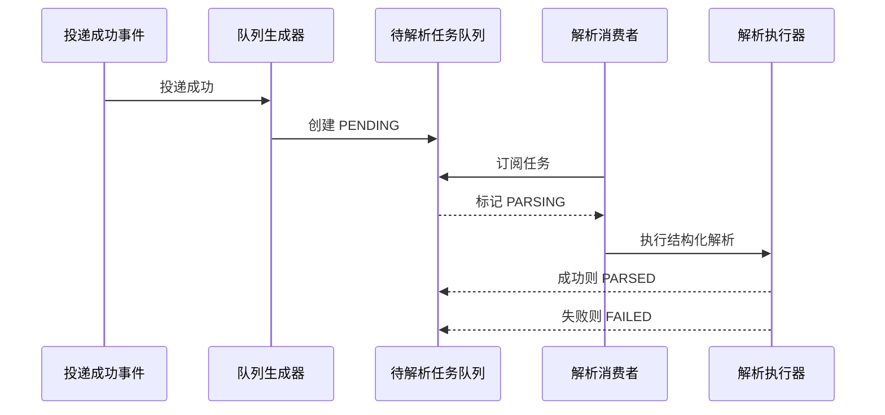

# 待解析任务队列实施方案

## 1. 目标

本方案承接 `doc/transfer-parse-queue-design.md`，进一步把“待解析任务队列”落成可以开发的接口、DTO、页面和状态流转契约。

核心目标只有一个：

- 让“投递成功后自动生成待解析任务”成为稳定、幂等、可补漏的业务链路

## 2. 现有能力复用

前端仓库已经具备以下可复用能力：

- `TransferObject` 页面：用于展示分拣对象事实
- `TransferDeliveryRecord` 页面：用于展示投递事实
- `TaskController` 下的 `/tasks/parse`：可作为低层解析执行接口
- 统一的 `SingleResult` / `MultiResult` / `PageResult` 返回范式

因此新能力建议只新增一层业务队列，不重做对象表，也不替换现有任务体系。

## 3. 数据契约

### 3.1 新增队列视图

建议新增：

- `ParseQueueViewDTO`

建议字段：

| 字段 | 说明 |
|---|---|
| `queueId` | 队列主键 |
| `businessKey` | 幂等键 |
| `transferId` | 分拣对象主键 |
| `originalName` | 原始文件名 |
| `sourceId` | 来源主键 |
| `sourceType` | 来源类型 |
| `sourceCode` | 来源编码 |
| `routeId` | 路由主键 |
| `deliveryId` | 投递记录主键 |
| `tagId` | 标签主键 |
| `tagCode` | 标签编码 |
| `tagName` | 标签名称 |
| `fileStatus` | 文件状态 |
| `deliveryStatus` | 投递状态 |
| `parseStatus` | 解析状态 |
| `triggerMode` | 触发方式 |
| `retryCount` | 重试次数 |
| `subscribedBy` | 订阅人 |
| `subscribedAt` | 订阅时间 |
| `parsedAt` | 解析完成时间 |
| `lastErrorMessage` | 最近失败原因 |
| `objectSnapshotJson` | 对象快照 |
| `deliverySnapshotJson` | 投递快照 |
| `parseRequestJson` | 解析请求上下文 |
| `parseResultJson` | 结构化输出结果 |
| `createdAt` | 创建时间 |
| `updatedAt` | 更新时间 |

### 3.2 新增分页返回

建议新增：

- `PageResultParseQueueViewDTO`
- `MultiResultParseQueueViewDTO`
- `SingleResultParseQueueViewDTO`

### 3.3 新增命令对象

建议新增以下命令：

- `ParseQueueGenerateCommand`
- `ParseQueueBackfillCommand`
- `ParseQueueClaimCommand`
- `ParseQueueCompleteCommand`
- `ParseQueueFailCommand`
- `ParseQueueRetryCommand`

## 4. 接口契约

### 4.1 查询

- `GET /api/transfer-parse-queues`
- `GET /api/transfer-parse-queues/{queueId}`

### 4.2 生成

- `POST /api/transfer-parse-queues/generate`
- `POST /api/transfer-parse-queues/backfill`

### 4.3 消费控制

- `POST /api/transfer-parse-queues/{queueId}/subscribe`
- `POST /api/transfer-parse-queues/{queueId}/complete`
- `POST /api/transfer-parse-queues/{queueId}/fail`
- `POST /api/transfer-parse-queues/{queueId}/retry`

### 4.4 推荐返回语义

- 查询分页使用 `PageResult`
- 单条详情使用 `SingleResult`
- 列表或批量动作使用 `MultiResult`

## 5. 生成逻辑

### 5.1 自动生成

自动生成只在投递成功后触发。

建议触发链路：

1. 投递执行成功
2. 投递记录写入成功
3. 提交事务后发布事件
4. 事件监听器调用队列生成器
5. 生成或更新 `t_parse_queue`

### 5.2 生成条件

仅当以下条件同时满足时入队：

- 文件状态 = `已识别`
- 投递状态 = `已投递`
- 标签 = `估值表`

### 5.3 幂等规则

建议以以下方式幂等：

- `businessKey = transferId + ':' + parseType`
- 对 `businessKey` 加唯一约束
- 入队前先查，存在有效队列则直接返回

## 6. 解析状态机

### 6.1 状态定义

- `PENDING`
- `PARSING`
- `PARSED`
- `FAILED`

### 6.2 状态流转

## 7. 手工补漏

### 7.1 单条补漏

按 `transferId` 补漏。

建议行为：

- 先查分拣对象
- 校验是否满足生成条件
- 若不存在队列则创建
- 若已存在且未完成，可按 `forceRebuild` 决定是否重建

### 7.2 批量补漏

按条件批量回补。

建议筛选条件：

- `sourceId`
- `routeId`
- `status`
- `deliveryStatus`
- `tagCode`
- `createdAt` 时间范围

建议提供 `dryRun`，用于先看影响范围。

## 8. 前端页面实施建议

### 8.1 新页面入口

建议新增：

- 菜单名：`待解析任务`
- 路由：`/transfer/parse-queue`

### 8.2 列表页面

建议沿用现有 Transfer 页面风格，列表字段如下：

- 队列主键
- 分拣对象主键
- 原始文件名
- 来源编码
- 路由主键
- 标签
- 文件状态
- 投递状态
- 解析状态
- 触发方式
- 重试次数
- 创建时间
- 解析完成时间
- 错误信息

### 8.3 页面操作

- 手工生成
- 批量补漏
- 重试
- 查看对象快照
- 查看投递快照
- 查看结构化结果

### 8.4 页面状态展示

建议对解析状态做固定文案映射：

- `PENDING` -> `待解析`
- `PARSING` -> `解析中`
- `PARSED` -> `已解析`
- `FAILED` -> `解析失败`

## 9. 与现有页面的关系

### 9.1 分拣对象页

分拣对象页保留事实查询职责，不承担队列消费职责。

可补充一个轻量动作：

- `生成待解析任务`

### 9.2 投递记录页

投递记录页只负责投递结果展示，不直接承担解析队列管理。

### 9.3 任务接口

现有 `/tasks/parse` 建议保留为底层执行接口，不直接作为业务用户入口。

## 10. 开发顺序

建议按以下顺序做：

1. 先新增 DTO 和接口定义
2. 再补队列页面和路由
3. 再补生成、补漏、重试动作
4. 最后接入详情快照和结果查看

这样可以确保“能生成、能补漏、能消费、能回查”四件事先闭环，再去做更细的结构化展示。
